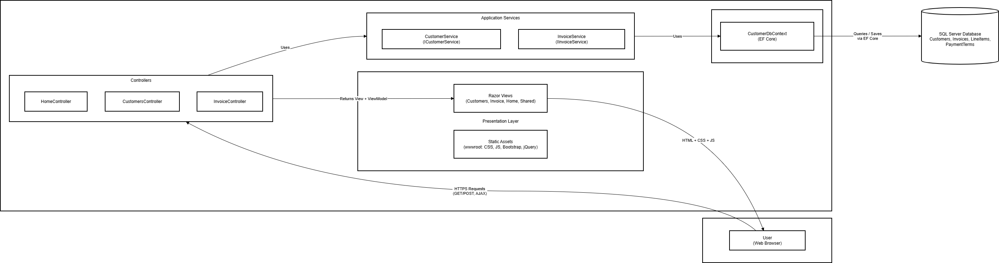
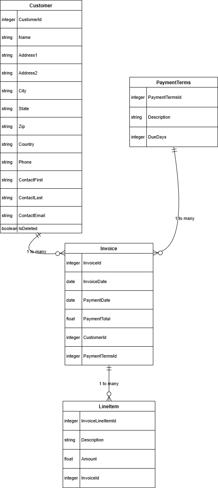

## InvoiceManagerMVC
  InvoiceManagerMVC is a simple Proof of concept ASP.NET Core MVC application for managing customers, invoices, payment terms, and line items. It provides a clean and professional workflow for businesses to track billing activity. The system is built using EF Core, SQL Server, Razor views, Bootstrap, and a layered service architecture.

## Key Features

  - Customer management with full CRUD and soft delete
  
  - Invoice creation linked to payment terms
  
  - Invoice line item management with dynamic totals
  
  - AJAX based line item loading for smooth UX
  
  - EF Core database with seeded demo data
  
  - Clear separation of concerns using services
  
  - Responsive UI with Bootstrap
  
  - Unit tests using xUnit and Moq

## System Architecture

  The application follows the ASP.NET Core MVC pattern. Responsibilities are separated into the presentation layer, controllers, services, EF Core data layer, and SQL Server storage.

  Architecture Summary :
  
  - Client browser sends HTTP GET and POST requests
  
  - Controllers handle requests and coordinate logic
  
  - Services perform business operations
  
  - EF Core DbContext manages persistence
  
  - SQL Server stores customers, invoices, line items, and payment terms
  
  -  Razor views return HTML with dynamic models
  
  - jQuery handles AJAX calls for invoice line items

  Architecture Diagram 

  
 
  
  Entity Relationship Diagram (ERD)

  

## Technologies Used

  - ASP.NET Core 7 MVC
  
  - Entity Framework Core
  
  - SQL Server
  
  - Razor Views
  
  - Bootstrap 5
  
  - jQuery
  
  - xUnit for unit testing
  
  - Moq for service mocking

## Project Structure
 ```
InvoiceManagerMVC/
│
├── WebApplication1/
│   ├── Controllers/
│   ├── Services/
│   ├── Entities/
│   ├── Models/
│   ├── Views/
│   ├── Migrations/
│   ├── wwwroot/
│   └── appsettings.json
│
└── TestProject1/
    ├── WebApplication1-Test.cs
    └── xUnit test assets
```
## Getting Started
  Prerequisites :
  
  - .NET 7 SDK or later
    
  - SQL Server (local or remote)
    
  - Visual Studio or VS Code
  
  1. Clone the Repository
  ```
  git clone https://github.com/sodiqadesina/InvoiceManagerMVC.git
  cd InvoiceManagerMVC

  ```
  2. Configure Database Connection
  Open appsettings.json and set your SQL Server connection:
  ```
  "ConnectionStrings": {
  "CourseConnectionString": "Server=YOUR_SERVER;Database=InvoiceDB;Trusted_Connection=True;TrustServerCertificate=True"
}

  ```

  3. Apply Migrations
  ```
  cd WebApplication1
  dotnet ef database update

  ```
  4. Run the Application
  ```
  dotnet run
  ```
  Visit:
  ```
  https://localhost:5001

  ```
  Running Tests
    Navigate to the test project:
    
    cd TestProject1
    dotnet test
  The test suite includes:

  - Form validation tests
  
  - CustomerController tests
  
  - InvoiceController tests
  
  - Service interaction tests using Moq
